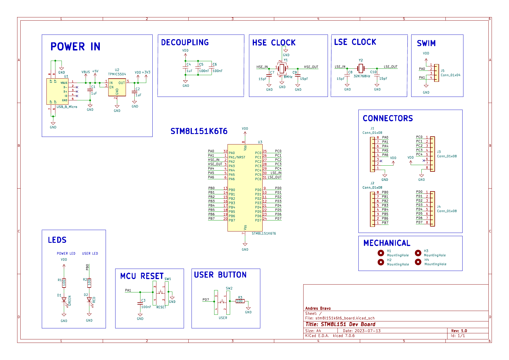
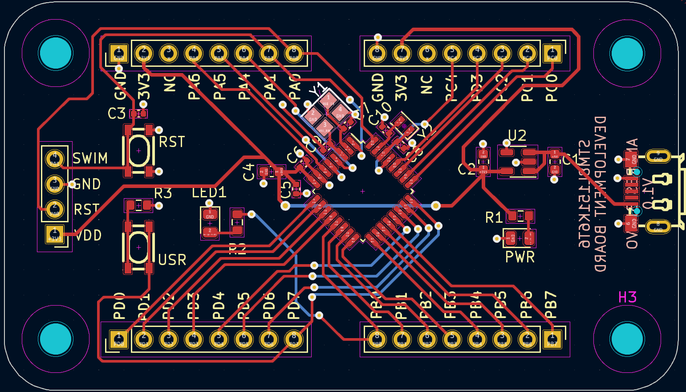

# STM8L151 Dev Board V2.0

This board was created with the intent to familiarize with the STM8 family of MCUs from ST Microcontroller.
The main features of this board are:

- Micro usb power input
- Power on led
- User led connected to PB0
- User button connected to PD7
- SWIM programming / debugging interface
- 8MHz High Speed External Clock
- 32.768 KHz Low Speed External Clock
- Reset Button
- Generick Male Headers for all I/O
- USB to UART converter
- Breadboard friendly
- 2 layer PCB for inexpensive manufacturing

## Version 2.0 Improvements

The following features were added/removed from the previous version:

- Increase resistor value for internal leds to reduce brightness.
- Added USB to UART converter.
- Reduced form factor to 18mm wide by 48mm long, in order to fit in a breadboard.
- Changed the male headers to use 2 1x16 headers instead of 4 1x8 headers.
- Male headers are spaced to fit in a breadboard.
- Kept backwards compatibility with the previous version on connection of internal peripherals.
- Mechanical mounting holes were changed to m2 2.2mm diameter holes.

The board was created using KiCad 6. It was mostly left up to the end user to decide its purspose
as it doesnt provide any internal sensors or ICs.

The DataSheet for the STM8L151K6T6 MCU: [datasheet](https://www.st.com/content/ccc/resource/technical/document/datasheet/43/12/db/4c/8b/08/4a/73/CD00240181.pdf/files/CD00240181.pdf/jcr:content/translations/en.CD00240181.pdf)

## Schematic

## PCB

## Finished Board

